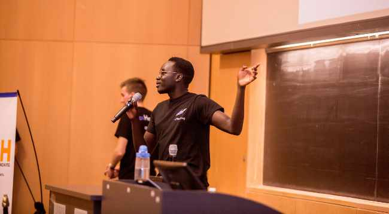

Wal Wal

101068557

## Question 1

a)

Independent variable ($x$): _diastolic blood pressure_

Dependent variable ($y$): _systolic blood pressure_

b) The bivariate data

```
Diastolic	Systolic
75				117
85				123
68				110
81				119
65				106
74				105
60				100
89				127
65				96
81				125
88				128
84				123
71				110
80				124
61				101
71				105
67				101
90				140
81				120
78				113
```

c) Relationship: Linear, positive




d) The regression equation

$`Systolic = 26.73 + 1.161(Diastolic)`$

Prediction of Systolic when $Diastolic = 70$

$Systolic=26.73+1.161(70)=108$


e) The regression equation

$`Systolic = 44.14 + 0.9461(Diastolic)`$

Given that the sample is only 20 (random) observations, it's understandable that the line equations are not exactly the same. They both, however share the same relation with their data, making it seem as if they're both trying to represent the same line.


I think if we applied the Law of Large numbers and increased the number of observations, we might achieve lines that are much closer.

## Question 2

a) K1 = 10


K1 = 1000


K1 = 100000


b) I believe we get the closest to the true probability when $K1=100000$ on the basis of the Law of Large Numbers, which explains that as the number of trials gets larger (approaches infinity), the relative frequency will converge at the true probability.

c) In this scenario, it's unreasonable to expect that a basketball player will shoot with the same consistency for enough free throws to have a significant amount of observations, i.e. the more the player shoots (consecutively) the less likely they are to get a basket.

## Question 3

We know the following information

$P(V)=5P(C)$

$P(S)=\frac{1}{2}P(C)$

$P(C) + P(V)+P(S)=1$

With this, we can substitute and solve for $P(C)$.

$P(C) + 5P(C)+\frac{1}{2}P(C)=1$

$\frac{13}{2}P(C)=1$

$P(C)=\frac{2}{13}$

$\therefore P(V)=5P(C)=\frac{10}{13}$

## Question 4

$G = green \space eyes$

$B=blonde \space hair$

a)

$P(G)=0.18$

$P(B) = 0.25$

$P(G \cap B)=0.11$

b) For two events to be mutually exclusive, the probability of their intersection $P(G /cap B)$ must be zero, which it isn't.

c) Proportion of people who don't have blonde hair: $100\% - 25\% = 75\%$

d) $P(G \cup B)=P(G)+P(B)-P(G \cap B)=0.18+0.25-0.11=0.32$

Therefore probability that a randomly selected person will have at least one of the two characteristics is 32%.

e) $P(G \cup B^C)=P(G) - P(G \cap B)=0.18 - 0.11=0.07$

Therefore 7% of people have green eyes but not blonde hair.

f) $P(G^C \cap B^C)=P((G \cup B)^C)=1-P(G \cup B)=1-0.32=0.67$

Therefore 67% of people have neither green eyes nor blonde hair.

## Question 5

a) $C^50_5=2118760$

b) Let D represent the set of combinations of 5 lightbulbs. Let E represent the event where the engineer gets 2 defective lightbulbs out of five

$n(D) = C^{50}_{5}=2118760$

$n(E)=C^{10}_{2}•C^{40}_{3}=45•9880=444600$

$P(E)=\frac{n(E)}{n(D)} \approx 0.21$

Therefore there's approximately a 21% chance that the engineer will pick exactly two defective light bulbs.

c) Let C represent the event where all five lightbulbs are not defective. Let F represent the event where the shipment is rejected (at least one lightbulb of five is defective).

$P(F)=P(C^C)$

$n(C)=C^{40}_{5}=658008$

$P(C)=\frac{n(C)}{n(D)} \approx 0.311$

$P(F)=P(C^C)=1-P(C) \approx 1 - 0.311 \approx 0.689$

Therefore there is approximately a 68.9% chance that the shipment will be rejected.

## Question 6

There are $4! = 24$ different ways to arrange the algebra books.

There are $2! =2$ different ways to arrange the calculus books.

There are $6! = 720$ different ways to arrange the stats books.

There are $3! = 6$ different ways to arrange these groups of books on the shelf

According to the Fundamental Counting Principle, there are $(4!)(2!)(6!)(3!)=207360$ different ways to place these books on a shelf so that books of the same subject are adjacent.

## Question 7

a) $s_{xy}=\frac{\sum{xy}-(\sum{x})(\sum{y})/n}{n-1}=\frac{23646-(133)(1405)/9}{8}=360.402\bar{7}$

$s_x^2=\frac{\sum{x^2}-(\sum{x})^2/n}{n-1}=43.9\bar{4}$, $s_x=6.63$

$s_y^2=\frac{\sum{y^2}-(\sum{y})^2/n}{n-1}=3481.86$, $s_y=59.01$

$r=\frac{s_{xy}}{s_xs_y}=0.9212$

This indicates that it's right to believe that the longer you're on the machine, the more calories you burn (strong, positive correlation)

b) $b=r\frac{s_y}{s_x}=0.9212(\frac{59.01}{6.63})=8.12$

$\bar{x}=133/9=14.\bar{7}$

$\bar{y}=1405/9=156.\bar{1}$

$a=156.1-8.12(14.78)=36.1$

$\therefore$ The least-squares regression line is $Y=36.1 + 8.12X$

c) $Y=36.1+8.12(20)=198.5$ calories
